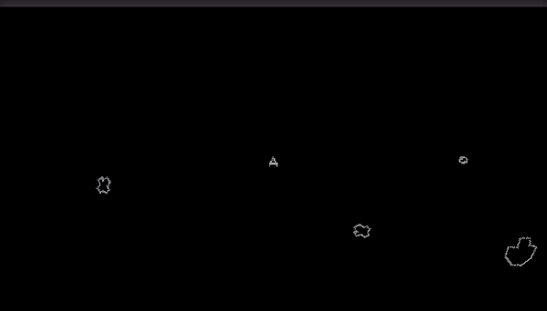
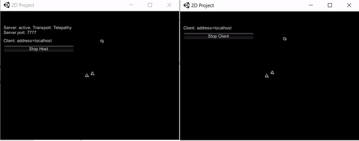

# Asteroids like game
<b>This is an Asteroids like made with Unity and C#</b>  
  

## TODO
* Explaination for online 

## WHY (MOTIVATION)
 
This tutorial was made for <b>Hector Pulido</b> for his youtube channel  
https://www.youtube.com/c/HectorAndresPulidoPalmar  
And his Twitch Channel 
[https://www.twitch.tv/hector_pulido_](https://www.twitch.tv/hector_pulido_) 

## Multiplayer
 
This is a Mirror based multiplayer version of Asteroid  
https://github.com/vis2k/Mirror

### To play
Enter to this url: http://asteroids-unity-web.herokuapp.com/index.html  
Make sure you entered by http not https

## Machine learning
 
This project uses the "Evolutionary Neural Networks on Unity For bots" repository 
https://github.com/HectorPulido/Evolutionary-Neural-Networks-on-unity-for-bots

## HOW TO USE
Copy the asset folder content in the asset folder of an empty unity project

## Licence
This Repo contains mirror networking (https://mirror-networking.com/), everything else is Mit licenced
